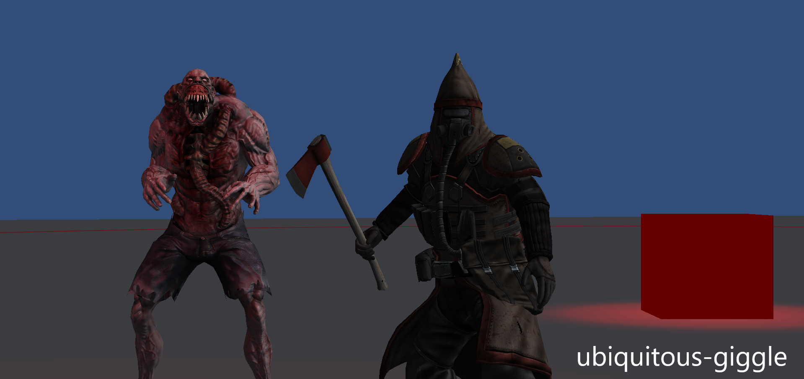

# ubiquitous-giggle

You, attached to your generator, must survive the hash days and nights from the enemies in the dark. Gather resources from nearby trees and slay the monsters to survive

The game was made as part of [GMTK's 2021 game jam](https://itch.io/jam/gmtk-2021), where the theme was "joined together".

	

